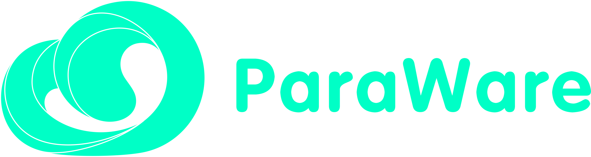

# Abstract

Cloud gaming is currently a 1% niche market but is expected to grow at a CAGR (Compounded Annual Growth Rate) of 43% over the next few years. ParaWare is a decentralized protocol created to provide ultra-low-cost delivery of 3D intensive cloud applications/games to generic devices via video streaming. The GPU-hungry (Graphical Processing Unit) application/game runs remotely on a virtual machine (VM), while the app display/screen is streamed in real-time to the end-user’s (players) device. Miners (machine owners) offer up their idle GPU-equipped VM’s to ParaWare players in exchange for ParaWare Coins (PWC). Stakeholders can stake their PWC on promising miners to earn a cut of the miner’s earnings. In addition to 3D applications and games, developers can also create value-added API’s and services such as game-mods, add-ons, search and indexing, ratings, reviews, price-comparison, etc. and deploy them to the VM’s. Miners get paid for providing the computing infrastructure, players pay (miners and developers) for the value-added services and cloud usage time, while developers earn a fee from players who use their services. Everything runs in a transparent and fair Web3 infrastructure, anchored to the cloud 3D gaming market. All in all, think of ParaWare as the Web3-enabled Airbnb of idle GPU’s (homes) and 3D Game Players (lodgers). We are confident that ParaWare can and will gradually evolve to become the defacto crowd sourced infrastructure driving the full adoption of the Metaverse by virtual of the fact that it allows the full immersive Metaverse to be experienced by anyone wearing any entry-level VR headset or device simply by streaming the highest quality AAA 3D graphics directly to it in real-time.

