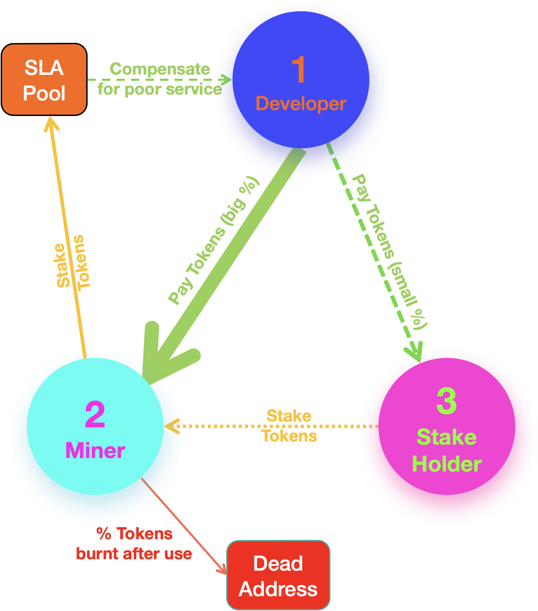

# 4.2 Incentives

Figure 4 shows the ParaWare incentives design. The player/consumer is not explicitly shown here, but occupies the same position as the developer. From the diagram, the incentives structure between the 3 class of roles are clear. Initially, developers will subsidize game play time for the players, but over time, the player will take on the role of the developer and start paying for usage.

Table 1 below summarizes the transactions between the various roles.

<figure><figcaption>
Table 1. Transactions between the various ParaWare roles.
</figcaption></figure>

****
